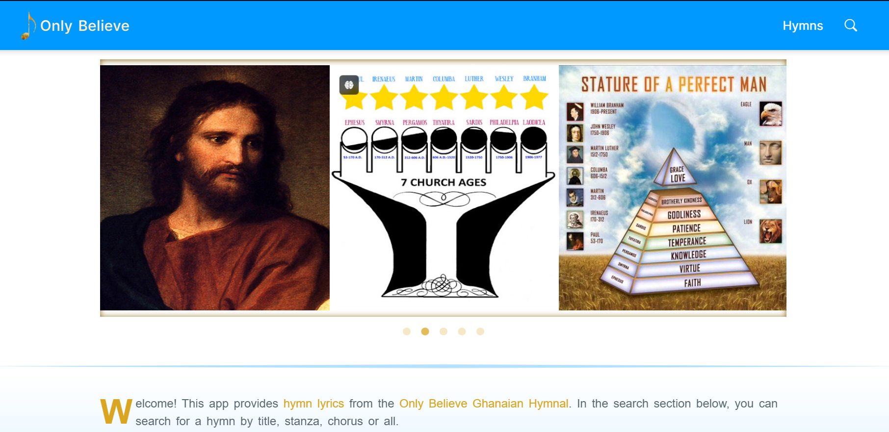

# ONLY BELIEVE HYMNAL WEB APP

Welcome to the Only Believe Hymnal App, a comprehensive digital hymnal designed to provide easy access to a moderate variety of hymns. This app is built with Angular and provides features such as searching for hymns, viewing hymn details, and more.

## Features

- **Search Hymns:** Easily search for hymns by title, chorus, verse, or all.
- **View Hymn Details:** Access the full lyrics of each hymn.
- **Navigation:** Smooth navigation between different sections and hymns.
- **Responsive Design:** Optimized for both desktop and mobile devices.
- **Animations:** Smooth transitions and animations for a better user experience.

## App Demo

Click to navigate to Only Believe Hymnal.

[](https://ruthyankson.github.io/hymnal/)


## Getting Started

Follow these instructions to get a copy of the project up and running on your local machine for development and testing purposes.

### Prerequisites

Make sure you have the following software installed on your machine:

- [Node.js](https://nodejs.org/) (version 17.x or later)
- [Angular CLI](https://angular.io/cli) (version 12.x or later)
*You may find further particulars in the package.json file*

## Installation

1. **Clone the Repository:**

    ```sh
    git clone https://github.com/ruthyankson/hymnal.git
    ```
2. **Navigate to the project directory:**
    
    ```sh
    cd hymnal
    ```

3. **Install Dependencies:**

    ```sh
    npm install
    ```

4. **Run the application:**

    ```sh
    ng serve
    ```
The app will be available at `http://localhost:4200`.


## Usage

1. **Searching for Hymns:** 

    -Use the search bar to find hymns by title, chorus, verse, or all.
    -Click on a hymn from the search results to view its details.
    -You may view the entire hymn list on the Hymns page and click on a hymn to view its details.

2. **Viewing Hymn Details**

    -The hymn details page displays the full lyrics of the selected hymn.
    -Navigate between stanzas and choruses using the provided chorus and stanza number links.

## Folder Structure
Here is a brief overview of the project's folder structure

  ```sh
  hymnal/
  ├── src/
  │   ├── app/
  │   │   ├── app-hymnal/
  │   │   │   ├── home/
  │   │   │   ├── hymn/
  │   │   │   ├── hymns/
  │   │   │   ├── song/
  │   │   │   └── app-hymnal.module.ts
  |   |   ├── page-not-found/
  |   |   ├── shared
  │   │   │   ├── components/
  │   │   │   |   ├── footer/
  │   │   │   |   ├── header/
  │   │   │   |   ├── hymn-detail/
  │   │   │   |   ├── modal/
  │   │   │   |   ├── page-heading/
  │   │   │   |   └── search/
  │   │   │   ├── constants/
  │   │   │   ├── models/
  │   │   │   ├── partial-styles/
  │   │   │   ├── pipes/
  |   |   |   ├── services/
  │   │   │   └── shared.module.ts
  |   |   ├── standalone-components/
  │   │   ├── models/
  │   │   └── app.module.ts
  │   ├── assets/
  |   |   ├── gifs/
  |   |   └── images/
  │   ├── styles.scss
  │   ├── main.ts
  │   └── index.html
  ├── .gitignore
  ├── README.md
  ├── angular.json
  ├── package.json
  └── tsconfig.json
  ```

## Built with
- [Angular](https://v17.angular.io/docs): The web framework used.
- [NgBootstrap](https://ng-bootstrap.github.io/#/home): CSS framework for responsive design.
- [Bootstrap Icons](https://icons.getbootstrap.com): Open source icon library.
- [NgSlickCarousel](https://www.npmjs.com/package/ngx-slick-carousel): Carousel used for home page.
- [SCSS](https://sass-lang.com): Sassy Cascading Style Sheets for responsive design.
- [AngularInMemoryWebAPI](https://github.com/angular/in-memory-web-api): An in-memory web api for app database.

## License

This project is licensed under the MIT License - see the LICENSE file for details.

## Acknowledgements
- Inspired by the Only Believe Hymnal book.
- Thanks to the Angular and Bootstrap teams for their awesome tools.
- Special thanks to Codemium for their invaluable support and resources towards the completion stage of this project.

<hr>

This README file provides a brief overview of the Only Believe Hymnal app, including its features, technology stack, prerequisites, installation steps, usage, and license information.


